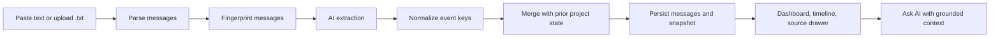
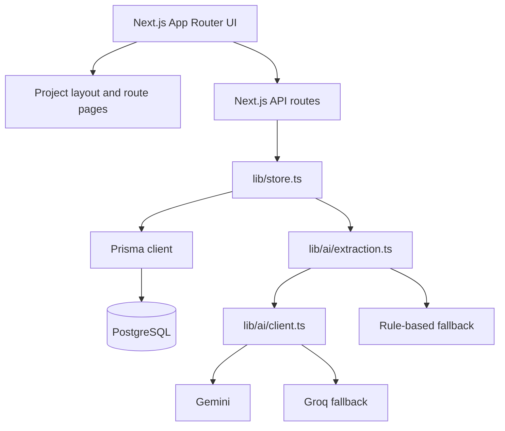

# ArchFlow AI

> AI-powered project communication intelligence for architecture and construction teams.

ArchFlow AI turns pasted project communication into a persistent, source-traceable project record: who owns what, what has been decided, what is blocked, and what needs attention next.

## Problem Statement

Construction and architecture decisions are spread across long message threads, emails, and meeting notes. Important responsibilities and dependencies are easy to miss, while contradictory instructions can remain invisible until they affect site work.

## Solution

ArchFlow AI accepts communication text, analyzes it with a provider-fallback AI pipeline, and incrementally builds a structured project state. Every extracted item keeps links to the source message IDs that support it, allowing a user to move from a dashboard insight back to the original text.

The current application imports pasted text or `.txt` files. The source selector supports `whatsapp`, `email`, and `meeting` labels; it does not connect directly to those external services.

## Key Features

- Project creation and project picker
- Text-area and `.txt` communication import
- Structured extraction of responsibilities, decisions, blockers, risks, deadlines, updates, and conflicts
- Owner and role tracking, including action-item types and dependencies
- Source message traceability through the source drawer
- Incremental project snapshots and a What Changed timeline
- Dashboard views for blockers, actions, pending decisions, risks, conflicts, and responsibilities
- Ask AI with answers grounded in stored project state and recent messages
- Gemini primary provider, Groq fallback, and deterministic rule-based fallback
- Message-level and event-level duplicate handling
- Responsive project workspace with route-level loading states

## How ArchFlow AI Works



1. A user creates or opens a project.
2. Communication is pasted or uploaded and submitted to the import route.
3. The parser splits the input into messages and assigns source, sender, content, and timestamps.
4. AI extracts a structured delta against the prior snapshot.
5. Deduplication merges new evidence without blindly appending repeated events.
6. Prisma writes new messages, an import batch, and a new state snapshot in a transaction.
7. The workspace renders the latest state and preserves source references.

## AI Capabilities

The extraction prompt requires a complete structured response containing:

- **Action items:** distinct responsibilities with owner, role, status, priority, type, due date, dependencies, and source evidence
- **People:** named participants and roles found in the communication
- **Decisions:** resolved choices such as an approved material or plan
- **Pending decisions:** approvals or choices still awaiting resolution
- **Blockers:** current work that cannot proceed and the condition needed to clear it
- **Risks:** potential issues, including clearly labeled inferred risks
- **Deadlines:** explicitly stated timing associated with relevant work
- **Updates:** meaningful project changes that are not current tasks
- **Conflicts:** contradictory stakeholder statements with a recommended action
- **Project state:** a concise summary plus all extracted categories

The model is instructed to use only supplied evidence, avoid inventing owners or deadlines, preserve source message IDs, and extract only new information unless a message changes an existing item’s status.

## Duplicate and Overlapping Conversation Handling

ArchFlow AI uses two complementary layers:

1. **Message deduplication:** each parsed message receives a SHA-256 fingerprint based on project, source, sender, and normalized content. Existing fingerprints are checked before insertion, and the database also enforces a composite uniqueness constraint on project and content hash.
2. **Event deduplication:** extracted items receive normalized event keys. Construction-specific synonyms such as `Option B`, `second option`, and `opt B` normalize to the same topic vocabulary. Jaccard similarity compares event keys within the same category.

When overlap is found, the merge logic can create a new event, skip a duplicate, add a new source reference, or update the existing event when its status changes. This preserves the current project state while retaining evidence from later messages.

## Dashboard

The dashboard is the project’s operational summary. It presents:

- Counts for action items, pending decisions, blockers, updates, and risks
- Active conflicts with both stakeholder statements and source links
- People & Responsibilities grouped by owner
- Current blockers, action items, pending decisions, risks, and recent changes
- Direct navigation to the full change timeline

The workspace uses a persistent project layout, while the individual tabs replace only their content area.

## Ask AI

Ask AI answers questions using stored project state and recent imported messages. The server selects relevant source messages using keyword matching, includes state context such as blockers and responsibilities, then asks the configured LLM provider for a concise JSON answer. Responses include source message references that can open the original evidence in the drawer.

If both configured LLM providers fail, the application uses deterministic answers for supported question patterns such as responsibility, installation delays, blockers, and marble options.

## Technology Stack

| Layer | Technology |
|---|---|
| Application | Next.js 15.5.25 App Router, React 19, TypeScript |
| UI | React client/server components, vanilla CSS, `lucide-react` |
| Fonts | `next/font` with Inter and Manrope |
| Data access | Prisma ORM 5.22 with PostgreSQL |
| Database | PostgreSQL, compatible with Neon |
| Primary AI | Google Gemini through `@google/genai` |
| Fallback AI | Groq SDK with `qwen/qwen3.8-27b` |
| Validation fallback | Deterministic rule-based extraction and answers |

## System / Technical Architecture



Project pages are server-rendered through the App Router, while `ProjectClient` handles workspace interaction, client-side state loading, imports, Ask AI submissions, and source drawers. API routes own mutations and AI operations. Persistent project data lives in PostgreSQL rather than in process memory.

## Database Architecture

The Prisma schema contains four related models:

| Model | Responsibility |
|---|---|
| `Project` | Project identity, description, and relationships |
| `Message` | Imported communication, sender, source, content, labels, and deduplication hash |
| `ImportBatch` | Groups one import operation and its messages |
| `ProjectStateSnapshot` | Stores the structured JSON state and human-readable changes after an import |

Projects own messages, import batches, and snapshots. Messages optionally belong to a batch, and snapshots optionally reference the batch that produced them. Project deletion cascades to related records.

## AI Processing Flow

1. `lib/store.ts` receives an import request.
2. `parseMessages` splits raw text into candidate messages.
3. `lib/ai/dedup.ts` fingerprints messages and filters known content.
4. The latest snapshot is supplied as prior context to extraction.
5. Gemini is attempted with a JSON response schema and a 20-second timeout.
6. Groq is attempted if Gemini fails, with a 25-second timeout.
7. If both providers fail or return an incomplete schema, rule-based extraction runs.
8. Extracted items receive normalized event keys and merge into prior state.
9. New messages, an import batch, and a snapshot are persisted transactionally.

## Installation and Local Setup

### Prerequisites

- Node.js 22 or a compatible current Node.js release
- npm
- PostgreSQL database, such as a Neon PostgreSQL database
- At least one supported AI provider key for AI extraction; the deterministic fallback can still handle supported patterns when providers are unavailable

### Install

```bash
npm install
```

Generate the Prisma client and apply the schema:

```bash
npm run db:generate
npm run db:push
```

## Environment Variables

Set these in a local `.env` file. Never commit real values:

```env
DATABASE_URL=your_postgresql_connection_string
GEMINI_API_KEY=your_gemini_api_key
GROQ_API_KEY=your_groq_api_key
```

| Variable | Purpose |
|---|---|
| `DATABASE_URL` | PostgreSQL connection string used by Prisma |
| `GEMINI_API_KEY` | Primary Gemini provider credential |
| `GROQ_API_KEY` | Fallback Groq provider credential |

At least one AI key is recommended. The application falls back to deterministic extraction when both providers are unavailable.

## Running the Project

Development server:

```bash
npm run dev
```

Open [http://localhost:3000](http://localhost:3000).

Production build and server:

```bash
npm run build
npm run start
```

Useful database commands:

```bash
npm run db:studio
npm run db:reset # destructive: resets the database schema and data
```

## Live Demo

**Deployed application:** `TODO: add deployed application URL`

## Demo Video

**Demo video:** `TODO: add demo video URL`

## Project Structure

```text
app/
	page.tsx                         Project picker server page
	home-client.tsx                  Project picker and creation UI
	layout.tsx                       Root layout and fonts
	globals.css / theme.css          Global and shared theme styles
	api/projects/                    Project, import, state, message, and Ask AI APIs
	projects/[id]/layout.tsx         Persistent project workspace layout
	projects/[id]/                   Dashboard and tab route markers
components/
	AppShell.tsx                     Project navigation shell
	ProjectClient.tsx                Workspace router and client interactions
	Dashboard.tsx                    Project state dashboard
	StateCards.tsx                   Reusable state item cards
	SourceDrawer.tsx                 Original message evidence drawer
	ImportCommunicationButton.tsx    Shared dashboard import action
	LoadingScreen.tsx                Full-screen loading overlay
lib/
	store.ts                         Prisma-backed ingestion and Ask AI logic
	types.ts                         Project state and domain types
	prisma.ts                        Prisma client singleton
	demoData.ts                      Built-in Sharma Residence demo input
	ai/client.ts                     LLM provider chain
	ai/extraction.ts                 Structured extraction and fallback rules
	ai/dedup.ts                      Message and event deduplication
prisma/schema.prisma               PostgreSQL data model
scripts/reset-db.ts                Database reset utility
```

## Future Improvements

- Authentication, authorization, and team-level project access
- Direct connectors for communication platforms and email
- PDF, DOCX, image, and OCR ingestion
- Pagination and background processing for very large projects
- Task completion, reassignment, notifications, and reminders
- Export to project-management tools and structured formats
- Real-time updates and collaborative activity feeds
- Multilingual extraction and voice-to-transcript workflows
- Automated and unit test coverage for extraction, deduplication, and routes

## Hackathon Context

ArchFlow AI is a hackathon prototype focused on a practical problem in architecture and construction: converting fragmented project communication into an operational record that teams can trust and inspect. The implementation emphasizes a complete vertical slice rather than a mock dashboard: text ingestion, AI extraction, fallback behavior, persistence, incremental state merging, source traceability, and grounded project questions are all connected through the working Next.js and Prisma application.
